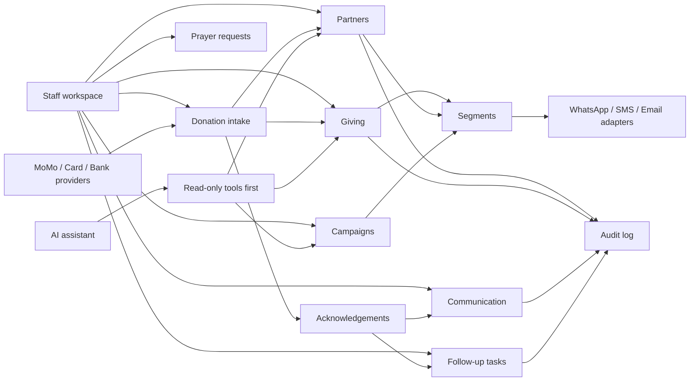

# Architecture

## Product Shape

BENMP PRM is a staff-only operational application. The app should complement or eventually replace the BENMP admin backend, not require partners to log in.

## Proposed Stack

- Frontend: Next.js 16 App Router, React 19, Tailwind CSS 4
- Backend/data: adapter-first. MVP uses typed mock repositories; production can use Supabase Postgres, Neon/Postgres, or AWS Aurora/Postgres.
- Integrations: Flutterwave or Hubtel for Mobile Money intake, Paystack for card/bank/mobile money coverage, WhatsApp Business Platform or Twilio, SMS/Voice provider, email provider
- AI: AI SDK 7 behind a local model registry and tool boundary
- Deployment: Vercel for web, Supabase for database/functions

## Main Modules



## Data Boundaries

- Partner identity and contact preferences are core.
- Raw payment events are intake data. Keep them for webhook traceability even before a partner match is confirmed.
- Giving records are financial history and should be tightly permissioned.
- Acknowledgement status and attention tier belong on contribution records so staff can see which gifts still need care.
- Payment providers remain systems of record for payment execution.
- Communication providers remain systems of record for delivery metadata, but normalized send history belongs in the PRM.
- AI should not bypass RLS or staff approval.

## Data Adapter Strategy

The MVP should not require a full database. It should start with typed mock repositories so the board can validate workflows before the technical team locks in a backend.

Current provider switch:

```txt
BENMP_DATA_PROVIDER=mock
```

Future providers:

- `supabase` for the fastest integrated MVP path.
- `postgres` for Neon, Aurora, or another managed Postgres deployment.

Repository methods should stay business-oriented and view-oriented. The current frontend consumes `PrmRepository` methods such as:

- `getOverview`
- `getPartnersView`
- `getGivingView`
- `getCommunicationView`
- `getFollowUpView`
- `getCampaignsView`
- `getPrayerView`
- `getAiOperationsView`
- `getAdminView`

Provider-specific concepts should stay inside repository implementations. UI code should not know whether data came from mock seed data, Supabase, Neon, Aurora, or another Postgres service.

## Auth And Roles

Use Supabase Auth for staff accounts. Use Postgres RLS for data authorization.

Initial roles:

- `super_admin`
- `admin`
- `finance`
- `communications`
- `regional_coordinator`
- `prayer_team`
- `viewer`

Regional coordinators should eventually be scoped by country or region assignments.

## Integration Strategy

Provider adapters should expose stable internal functions, for example:

- `receivePaymentWebhook`
- `verifyPaymentEvent`
- `matchPaymentToPartner`
- `createAcknowledgementDraft`
- `sendWhatsAppMessage`
- `sendSmsMessage`
- `sendEmailMessage`
- `createPaymentImport`
- `reconcilePaymentImport`

Current provider switch:

```txt
BENMP_MESSAGING_PROVIDER=mock
BENMP_PAYMENT_PROVIDER=mock
```

Future providers:

- `flutterwave` for a MoMo-led MVP with card and webhook support.
- `hubtel` for Ghana-first MoMo operations if the board prefers a local payment platform.
- `paystack` for card, bank transfer, Ghana DVA, and regional mobile money coverage.
- `twilio` for faster WhatsApp/SMS/voice pilot work.
- `meta-cloud-api` for long-term direct WhatsApp Business Platform ownership.

This keeps the application independent from any single provider.

## AI Strategy

AI SDK 7 is installed but should not drive MVP architecture. The first AI implementation should be read-only:

1. Partner briefing
2. Segment explanation
3. Payment import reconciliation suggestions
4. Draft communication copy
5. Donation-triggered acknowledgement drafts and caller briefs

Tool calls that mutate data or send messages require explicit staff approval.

## Security Notes

- Never commit real partner exports, payment data, tokens, or secrets.
- Avoid storing card data. Store provider references only.
- Log sensitive actions in `audit_log`.
- Keep message consent and opt-out status per channel.
- Use service role keys only in server-only contexts.
