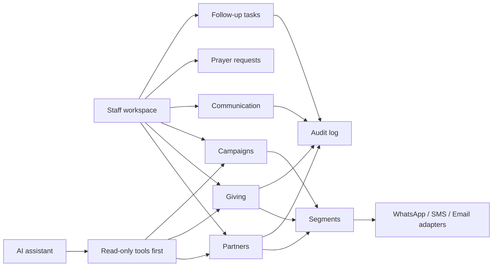

# Architecture

## Product Shape

BENMP PRM is a staff-only operational application. The app should complement or eventually replace the BENMP admin backend, not require partners to log in.

## Proposed Stack

- Frontend: Next.js 16 App Router, React 19, Tailwind CSS 4
- Backend/data: Supabase Postgres, Auth, Row Level Security, Storage, Edge Functions
- Integrations: Paystack, PayPal, WhatsApp Business Platform or Twilio, SMS/Voice provider, email provider
- AI: AI SDK 7 behind a local model registry and tool boundary
- Deployment: Vercel for web, Supabase for database/functions

## Main Modules

## Data Boundaries

- Partner identity and contact preferences are core.
- Giving records are financial history and should be tightly permissioned.
- Payment providers remain systems of record for payment execution.
- Communication providers remain systems of record for delivery metadata, but normalized send history belongs in the PRM.
- AI should not bypass RLS or staff approval.

## Auth And Roles

Use Supabase Auth for staff accounts. Use Postgres RLS for data authorization.

Initial roles:

- `super_admin`
- `admin`
- `finance`
- `communications`
- `regional_coordinator`
- `prayer_team`
- `viewer`

Regional coordinators should eventually be scoped by country or region assignments.

## Integration Strategy

Provider adapters should expose stable internal functions, for example:

- `sendWhatsAppMessage`
- `sendSmsMessage`
- `sendEmailMessage`
- `createPaymentImport`
- `reconcilePaymentImport`

This keeps the application independent from any single provider.

## AI Strategy

AI SDK 7 is installed but should not drive MVP architecture. The first AI implementation should be read-only:

1. Partner briefing
2. Segment explanation
3. Payment import reconciliation suggestions
4. Draft communication copy

Tool calls that mutate data or send messages require explicit staff approval.

## Security Notes

- Never commit real partner exports, payment data, tokens, or secrets.
- Avoid storing card data. Store provider references only.
- Log sensitive actions in `audit_log`.
- Keep message consent and opt-out status per channel.
- Use service role keys only in server-only contexts.
