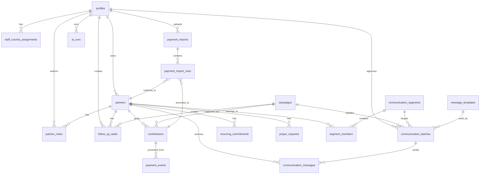
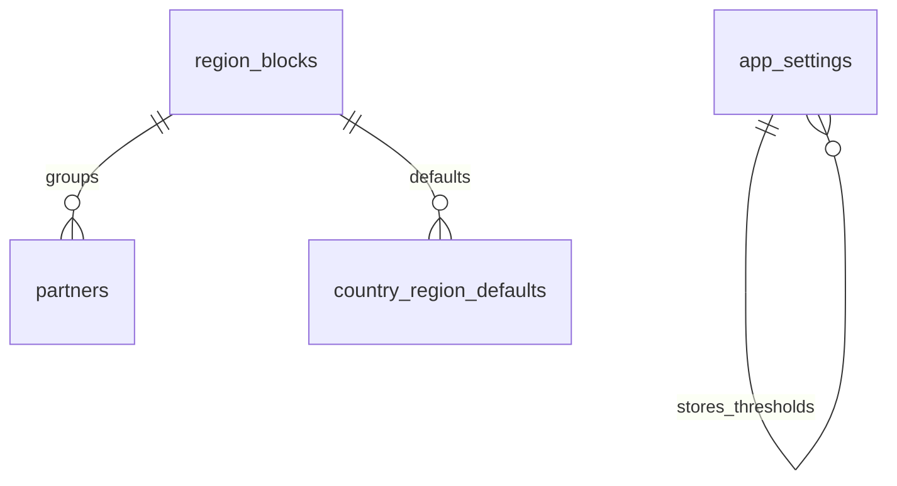

# Database Schema

> Human-readable schema contract for BENMP PRM. Implemented schema lives in `supabase/migrations/`; if this document and migrations disagree, migrations win until both are deliberately updated in the same change.

## 1. Status

Current implemented draft:

- `supabase/migrations/0001_initial_schema.sql`

Required next migration from the delivery plan:

- `supabase/migrations/0002_foundation_config.sql`

This project uses Supabase Postgres first, but the data model should remain ordinary Postgres. Business logic should stay behind `PrmRepository`, payment adapters, messaging adapters, and AI tools so Neon, Aurora Postgres, or Cloud SQL remain possible exits later.

## 2. Conventions

| Area              | Convention                                                                                                                                                 |
| ----------------- | ---------------------------------------------------------------------------------------------------------------------------------------------------------- |
| Primary keys      | UUID primary keys with `gen_random_uuid()` except `profiles.id`, which references `auth.users(id)`.                                                        |
| Timestamps        | `timestamptz`, default `now()`, updated by `set_updated_at()` triggers where records are mutable.                                                          |
| Money             | Current `0001` stores original money as integer minor units plus currency. Planned `0002` adds `contributions.usd_equivalent numeric` for threshold rules. |
| Card data         | No card numbers or sensitive payment method details are stored.                                                                                            |
| Provider payloads | Raw provider evidence is stored in `jsonb` on payment-related tables.                                                                                      |
| RLS               | RLS is enabled on all operational tables in `0001`.                                                                                                        |
| Soft delete       | Not implemented in `0001`. If added later, it must be documented and enforced consistently.                                                                |
| Region scope      | Country assignment exists in `0001`; region blocks are planned in `0002`.                                                                                  |
| Audit             | Sensitive changes must write `audit_log`; table-level RLS alone is not enough.                                                                             |

## 3. ERD

Planned `0002` relationships:

## 4. Enum Types

| Enum                     | Values                                                                                                                                                                                     |
| ------------------------ | ------------------------------------------------------------------------------------------------------------------------------------------------------------------------------------------ |
| `staff_role`             | `super_admin`, `admin`, `finance`, `communications`, `regional_coordinator`, `prayer_team`, `viewer`                                                                                       |
| `partner_status`         | `new`, `active`, `needs_follow_up`, `paused`, `inactive`, `do_not_contact`                                                                                                                 |
| `partnership_level`      | `prayer`, `monthly`, `quarterly`, `annual`, `major`, `one_time`, `unknown`                                                                                                                 |
| `giving_frequency`       | `monthly`, `quarterly`, `annually`, `one_time`, `irregular`, `unknown`                                                                                                                     |
| `communication_channel`  | `whatsapp`, `sms`, `email`, `phone`, `none`                                                                                                                                                |
| `payment_method`         | `flutterwave_mobile_money`, `hubtel_mobile_money`, `paystack_card`, `paystack_mobile_money`, `paystack_bank_transfer`, `mobile_money`, `paypal`, `bank_transfer`, `cash`, `check`, `other` |
| `contribution_status`    | `pending`, `succeeded`, `failed`, `refunded`, `cancelled`                                                                                                                                  |
| `acknowledgement_status` | `pending`, `drafted`, `sent`, `failed`                                                                                                                                                     |
| `attention_tier`         | `standard`, `active_year_covered`, `high_touch`                                                                                                                                            |
| `task_status`            | `open`, `in_progress`, `done`, `cancelled`                                                                                                                                                 |
| `prayer_request_status`  | `open`, `praying`, `responded`, `closed`                                                                                                                                                   |
| `message_status`         | `draft`, `queued`, `sent`, `delivered`, `failed`, `cancelled`                                                                                                                              |

Note: `payment_method` still contains `flutterwave_mobile_money` because the initial draft allowed it. Decisions demote Flutterwave to fallback; new implementation should prefer Paystack/Hubtel/Stripe while leaving the enum value harmless for imports or migration history.

## 5. Staff And Authorization Tables

### `profiles`

Purpose: staff profile tied to Supabase Auth.

Fields:

- `id uuid primary key references auth.users(id)`
- `role staff_role`
- `full_name text`
- `email text`
- `is_active boolean`
- `created_at timestamptz`
- `updated_at timestamptz`

Rules:

- Inactive staff should not receive role privileges through helper functions.
- `profiles.id` is the staff identity for audit, ownership, approvals, and AI runs.

### `staff_country_assignments`

Purpose: first version of coordinator scoping by country.

Fields:

- `id uuid primary key`
- `staff_id uuid references profiles(id)`
- `country text`
- `created_at timestamptz`
- unique `(staff_id, country)`

Planned change:

- Region-block scoping should be layered on top in Phase 6. Do not remove this table until the coordinator access model is finalized.

### Helper functions

| Function                                | Purpose                                                       |
| --------------------------------------- | ------------------------------------------------------------- |
| `set_updated_at()`                      | Updates `updated_at` before mutable table updates.            |
| `current_staff_role()`                  | Returns active staff role for `auth.uid()`.                   |
| `can_manage_all()`                      | True for `super_admin` and `admin`.                           |
| `can_read_country(target_country text)` | Allows broad staff reads and future country assignment reads. |

## 6. Partner Care Tables

### `partners`

Purpose: core partner profile and status record.

Important fields:

- Identity/contact: `full_name`, `mobile_number`, `whatsapp_number`, `email`
- Location/church: `country`, `city`, `church`, `denomination`
- Relationship: `partner_since`, `partnership_level`, `preferred_giving_frequency`, `preferred_communication_method`
- Care: `birthday`, `status`, `tags`, `notes`, `assigned_to`
- Giving rollups: `lifetime_giving_minor`, `lifetime_giving_currency`, `last_contribution_date`, `active_year_covered_until`, `attention_tier`
- Audit: `source`, `created_by`, `created_at`, `updated_at`

Indexes:

- `partners_country_idx`
- `partners_status_idx`
- `partners_assigned_to_idx`

Planned `0002` addition:

- `region_block_id uuid references region_blocks(id)`

Implementation notes:

- Store normalized phone data in a future column or deterministic helper before matching at scale.
- Keep raw source labels for imports, but never store private sheet contents beyond needed partner fields.

### `partner_notes`

Purpose: staff notes on a partner.

Fields: `partner_id`, `author_id`, `body`, `is_sensitive`, `created_at`.

Rules:

- Sensitive notes require narrower read treatment than ordinary relationship notes.
- Partner-supplied text is untrusted in AI prompts.

### `prayer_requests`

Purpose: prayer queue and care follow-up.

Fields: `partner_id`, `request_text`, `status`, `is_sensitive`, `assigned_to`, `responded_at`, timestamps.

Rules:

- Default `is_sensitive = true`.
- Prayer team and admins manage these records in `0001` RLS.

### `follow_up_tasks`

Purpose: operational queue for calls, WhatsApp follow-ups, acknowledgement work, lapsed care, and campaign-related follow-up.

Fields: `partner_id`, `campaign_id`, `assigned_to`, `created_by`, `title`, `reason`, `channel`, `priority`, `status`, `due_on`, `completed_at`, `outcome`, timestamps.

Index:

- `follow_up_tasks_status_due_idx`

Rules:

- High-touch gifts should create priority tasks.
- Viewer role must not write tasks.

## 7. Giving Tables

### `payment_events`

Purpose: immutable intake record for all money-like signals.

Fields:

- Provider identity: `provider`, `provider_event_id`, `provider_reference`, `event_type`
- Status/evidence: `status`, `raw_payload`, `received_at`, `processed_at`
- Money: `amount_minor`, `currency`, `payment_method`
- Donor identity: `donor_display_name`, `donor_phone`, `donor_email`
- Promotion link: `contribution_id`
- Unique `(provider, provider_event_id)`

Indexes:

- `payment_events_provider_reference_idx`
- `payment_events_status_idx`

Rules:

- Webhook and statement import paths both write here.
- Replays must be idempotent.
- Events should be append-only in business logic even if the database does not yet enforce append-only triggers.

### `contributions`

Purpose: verified giving ledger.

Fields:

- Links: `partner_id`, `campaign_id`
- Gift: `contribution_date`, `amount_minor`, `currency`, `payment_method`
- Provider: `provider`, `provider_reference`, unique `(provider, provider_reference)`
- Donor display: `donor_display_name`, `donor_phone`, `donor_email`
- Status/care: `status`, `acknowledgement_status`, `attention_tier`, `annual_coverage_months`, `requires_call`, `acknowledged_at`
- Evidence: `raw_payload`
- Audit: `created_by`, timestamps

Indexes:

- `contributions_partner_date_idx`
- `contributions_campaign_idx`

Planned `0002` addition:

- `usd_equivalent numeric null`

Rules:

- Create contributions only from verified `payment_events`.
- Do not use JavaScript floats for threshold decisions.

### `recurring_commitments`

Purpose: subscription-like giving commitments where a provider supports them, especially Stripe.

Fields:

- `partner_id`
- `provider`
- `provider_subscription_code`
- `amount_minor`
- `currency`
- `frequency`
- `status`
- `next_payment_date`
- `last_payment_date`
- `failed_payment_count`

Unique:

- `(provider, provider_subscription_code)`

Rules:

- Do not assume MoMo recurring mandates exist.
- Stripe subscriptions can use this table once webhook handling lands.

### `payment_imports`

Purpose: uploaded statement/import batch metadata.

Fields:

- `provider`
- `filename`
- `status`
- `row_count`
- `matched_count`
- `ambiguous_count`
- `created_by`
- timestamps

Rules:

- Filenames should not reveal private account numbers.
- Real statement files should not be committed.

### `payment_import_rows`

Purpose: row-level statement/import evidence and matching state.

Fields:

- `import_id`
- `partner_id`
- `contribution_id`
- `raw_row jsonb`
- `match_status`
- `match_confidence numeric(5,2)`
- `notes`
- `created_at`

Rules:

- Re-importing the same row must be inert once row-hash dedupe lands.
- Matched rows promote through the same payment event path as webhooks.

## 8. Campaign Tables

### `campaigns`

Purpose: crusade/campaign records for giving attribution and reports.

Fields:

- `name`
- `country`
- `city`
- `starts_on`
- `ends_on`
- `status`
- `funding_goal_minor`
- `funding_currency`
- `souls_reported`
- `report_summary`
- `public_url`
- timestamps

Rules:

- Campaign giving should attach through `contributions.campaign_id`.
- Campaign updates can drive communication batches.

## 9. Communication Tables

### `communication_segments`

Purpose: saved partner filters for messaging.

Fields: `name`, `description`, `filter_json`, `created_by`, timestamps.

Rules:

- Segment criteria must be inspectable before bulk sending.

### `segment_members`

Purpose: materialized segment membership.

Fields:

- `segment_id`
- `partner_id`
- `added_at`
- primary key `(segment_id, partner_id)`

### `message_templates`

Purpose: reusable message bodies and provider template metadata.

Fields:

- `name`
- `channel`
- `subject`
- `body`
- `provider_template_id`
- `category`
- `language`
- `status`
- `created_by`
- timestamps

Rules:

- WhatsApp provider template status must be respected before production send.
- Prophet/prayer broadcast categories require extra approval in later phases.

### `communication_batches`

Purpose: staff-approved outbound batch.

Fields:

- `segment_id`
- `campaign_id`
- `template_id`
- `name`
- `channel`
- `status`
- `scheduled_for`
- `created_by`
- `approved_by`
- `approved_at`
- timestamps

Rules:

- Bulk sends must not dispatch without `approved_by` and `approved_at`.

### `communication_messages`

Purpose: individual outbound message status.

Fields:

- `batch_id`
- `partner_id`
- `channel`
- `recipient`
- `subject`
- `body`
- `status`
- `provider`
- `provider_message_id`
- `error_message`
- `sent_at`
- `delivered_at`
- timestamps

Index:

- `communication_messages_partner_idx`

Rules:

- Provider delivery callbacks update this table.
- Opt-outs must prevent message creation or dispatch, not only provider send.

## 10. AI And Audit Tables

### `ai_runs`

Purpose: AI workflow audit trail.

Fields:

- `user_id`
- `workflow`
- `model`
- `input_summary`
- `output_summary`
- `tool_calls jsonb`
- `status`
- `created_at`

Rules:

- Store summaries and tool metadata, not unnecessary raw sensitive prompts.
- AI inherits invoking user scope.

### `audit_log`

Purpose: security and operations evidence.

Fields:

- `actor_id`
- `action`
- `entity_table`
- `entity_id`
- `before_data jsonb`
- `after_data jsonb`
- `created_at`

Index:

- `audit_log_entity_idx`

Rules:

- Required for imports, reconciliation, contribution corrections, message approvals/sends, role changes, provider setting changes, AI approvals, and sensitive prayer actions.

## 11. Current RLS Summary

| Area                  | Current RLS Behavior                                                                                                                                        |
| --------------------- | ----------------------------------------------------------------------------------------------------------------------------------------------------------- |
| Profiles              | Staff can select self; admins manage all.                                                                                                                   |
| Country assignments   | Admins manage; staff can select own assignments.                                                                                                            |
| Partners              | Authenticated staff can select according to `can_read_country`; finance/comms/admin/coordinator can insert; admins/assigned staff/finance/comms can update. |
| Campaigns             | Authenticated staff can select; admin/comms can write.                                                                                                      |
| Contributions         | Super admin/admin/finance can select and write.                                                                                                             |
| Payment events        | Super admin/admin/finance can write.                                                                                                                        |
| Recurring commitments | Super admin/admin/finance can write.                                                                                                                        |
| Partner notes         | Broad staff read, with narrower prayer-team handling for sensitive notes; authenticated insert.                                                             |
| Prayer requests       | Super admin/admin/prayer team can manage.                                                                                                                   |
| Follow-up tasks       | Authenticated select; non-viewer staff write.                                                                                                               |
| Communications        | Authenticated select; admin/comms write.                                                                                                                    |
| Payment imports       | Super admin/admin/finance write.                                                                                                                            |
| AI runs               | User can select own runs; admin can select all; user can insert own.                                                                                        |
| Audit log             | Admins select; authenticated users insert.                                                                                                                  |

Gap to resolve in implementation:

- Decision 0004 says "all staff see all initially; role controls writes." Current `partners_select_staff` uses `can_read_country(country)`, which currently grants broad reads to most roles but not `regional_coordinator` unless assigned. Phase 1A should deliberately choose and test the intended behavior.

## 12. Required `0002_foundation_config.sql`

Phase 1A must add:

### `region_blocks`

Purpose: configurable management/reporting groups.

Recommended fields:

- `id uuid primary key default gen_random_uuid()`
- `name text not null unique`
- `sort_order integer not null`
- `is_active boolean not null default true`
- `created_at timestamptz not null default now()`
- `updated_at timestamptz not null default now()`

Seed values:

1. Ghana
2. Rest of Africa
3. Europe
4. UK
5. America

### `country_region_defaults`

Purpose: default country-to-region-block mapping for imports.

Recommended fields:

- `id uuid primary key default gen_random_uuid()`
- `country text not null unique`
- `region_block_id uuid not null references region_blocks(id)`
- `created_at timestamptz not null default now()`

### `partners.region_block_id`

Purpose: one region block per partner, overridable by staff.

Recommended field:

- `region_block_id uuid references region_blocks(id) on delete set null`

Recommended index:

- `partners_region_block_idx`

### `app_settings`

Purpose: editable thresholds and feature kill switches.

Recommended fields:

- `key text primary key`
- `value jsonb not null`
- `description text`
- `updated_by uuid references profiles(id) on delete set null`
- `updated_at timestamptz not null default now()`

Seed keys:

- `active_year_threshold_usd = 60`
- `high_touch_threshold_usd = 100`
- `auto_send_acknowledgements = false`

### `contributions.usd_equivalent`

Purpose: threshold and reporting value in USD at gift-date rate.

Recommended field:

- `usd_equivalent numeric(18,2)`

Rule:

- Keep original currency and original amount. USD equivalent is a reporting/rules helper, not a replacement for original money.

## 13. Later Planned Tables And Columns

| Table                                                     | Phase | Trigger                                                                      |
| --------------------------------------------------------- | ----- | ---------------------------------------------------------------------------- |
| `fx_rates`                                                | 2A/2B | Needed once USD-equivalent values are calculated from non-USD gifts.         |
| `claims`                                                  | 3     | Only if remittance-app giving is significant enough to build the claim loop. |
| `monthly_snapshots`                                       | 5     | Needed for frozen month-close reports.                                       |
| `sequence_definitions`, `sequence_runs`, `sequence_steps` | 5     | Only if manual message batches become the bottleneck.                        |
| `approval_policies`                                       | 5+    | Only when per-batch approval becomes the bottleneck (srs FR-7.7).            |
| `webhook_dead_letters`, `webhook_replays`                 | 6     | Needed for production-grade retry/replay tooling.                            |

Planned columns (needed by specific phases; add in that phase's migration):

| Column                                                             | Phase | Why                                                                                                 |
| ------------------------------------------------------------------ | ----- | ---------------------------------------------------------------------------------------------------- |
| `partners.normalized_phone text` + index                           | 1B    | E.164 canonical phone is the matching key for MoMo and WhatsApp; text-column scans won't hold at 40k. |
| `payment_import_rows.row_hash text` + unique index                 | 2B    | Statement re-imports must be inert; webhooks dedupe on `(provider, provider_event_id)`, rows need their own key. |
| `partners` per-channel consent (`whatsapp_consent`, `sms_consent`, `email_consent` + timestamps/source) | 3     | FR-7.4: every send checks consent; nothing stores it today.                                          |
| `ai_runs.input_tokens`, `ai_runs.output_tokens`, `ai_runs.cost_usd` | 4     | Design-spec §8 promises per-run token/cost logging; current table has none.                          |
| `communication_batches.second_approved_by/_at`                      | 5     | FR-7.6: prophet-category content needs two distinct named approvers; one `approved_by` can't express it. |

## 14. Seed Data

Minimum live seed should include:

- One `super_admin` staff profile.
- One `viewer` staff profile for negative permission testing.
- Region blocks from Section 12.
- `app_settings` thresholds from Section 12.
- Minimal message template drafts for acknowledgement and monthly reminder, not auto-send.

Do not seed real partner exports or statements into git.
